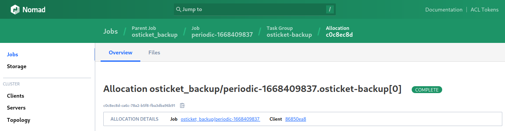

# Nomadic BORG

Run periodic backups using Hashicorp Nomad's __Periodic Stanza__ with the [BORG](https://mpolinowski.github.io/docs/DevOps/Linux/2022-11-09--docker-borg-backupserver/2022-11-09) Docker container by [@pschiffe](https://hub.docker.com/u/pschiffe):


```bash
type = "batch"

periodic {
    cron = "@daily"
}

reschedule {
    attempts  = 0
    unlimited = false
}
```

See [backup-service.tf](/blob/master/backup-service.tf) for an example to backup the MariaDB Database data directory of an PHP CMS (OSTicket).


## Restore a Backup

A [restore can be run manually](https://mpolinowski.github.io/docs/DevOps/Hashicorp/2022-11-11-hashicorp-nomad-for-borg-backups/2022-11-11#restore) and then copied to the data directory restoring the old database. To find the correct backup we have to find the short allocation ID for the backup job run:





In the case above it is `c0c8ec8d`. We have to use the `ARCHIVE=c0c8ec8d` environment variable accordingly to retrieve your data:


```bash
docker run \
  --rm \
  -e BORG_REPO=/opt/borg \
  -e ARCHIVE=c0c8ec8d \
  -e BORG_PASSPHRASE=mypassword \
  -e EXTRACT_TO=/borg/output \
  -v /opt/borg/config:/root \
  -v /opt/borg/repo:/opt/borg \
  -v /opt/borg/output:/borg/output/data \
  --security-opt label:disable \
  --name borg-backup \
  pschiffe/borg

...

terminating with success status, rc 0
```
